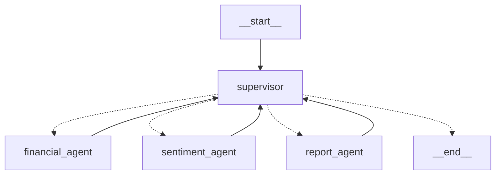

# 📊 한국 주식 분석 AI 에이전트 - 완성 보고서

## 🎯 프로젝트 개요

**LangGraph Supervisor Pattern** 기반 한국 주식 시장 특화 AI 에이전트 시스템이 완성되었습니다.
- **Multi-Agent System**: Supervisor + 3개 ReAct 에이전트 (Financial, Sentiment, Report)
- **한국 주식 시장 완전 대응**: KRX, KOSPI, KOSDAQ
- **실시간 스트리밍**: Streamlit 기반 한국어 UI
- **GPT-4 기반**: 한국어 감정분석 및 투자 보고서 생성

## ✅ 완성된 시스템 아키텍처

### 🔄 LangGraph Supervisor Pattern


### 🎯 핵심 구성요소

#### 1. Korean Supervisor (agents/korean_supervisor_langgraph.py)
- **역할**: LLM 기반 워크플로우 조율 및 동적 라우팅
- **기능**: GPT-4로 다음 에이전트 결정, 진행상황 관리
- **구현**: StateGraph + conditional edges

#### 2. Korean Financial ReAct Agent (agents/korean_financial_react_agent.py)  
- **데이터 소스**: FinanceDataReader + PyKRX
- **도구**: 주가 데이터 수집, 기술적 분석, 차트 생성
- **출력**: matplotlib 한국어 차트 + 재무 분석 보고서

#### 3. Korean Sentiment ReAct Agent (agents/korean_sentiment_react_agent.py)
- **뉴스 소스**: 네이버 뉴스 API + Google News RSS + 다음 뉴스
- **분석**: GPT-4 한국어 감정분석 + 키워드 추출
- **폴백**: 다중 뉴스 소스로 안정성 확보

#### 4. Korean Report ReAct Agent (agents/korean_report_react_agent.py)
- **보고서 구성**: Executive Summary + 상세 분석 + Risk Assessment
- **생성 엔진**: GPT-4 기반 한국어 투자 보고서
- **출력**: 종합 투자 의견 및 추천

### 🖥️ 사용자 인터페이스

#### Korean Streamlit UI (main.py)
- **한국어 완전 지원**: 종목코드, 회사명, 분석 결과 모두 한국어
- **실시간 스트리밍**: LangGraph 진행상황 실시간 표시
- **인기 종목**: 삼성전자, 카카오, 네이버 등 원클릭 분석
- **결과 다운로드**: JSON 형태 분석 결과 저장

## 🔧 기술 스택 및 데이터 소스

### 🤖 AI & ML
- **OpenAI GPT-4o**: 한국어 감정분석, 투자 보고서 생성
- **LangGraph**: Supervisor Pattern Multi-Agent 워크플로우
- **LangChain**: ReAct Agent 패턴 구현

### 📊 한국 주식 데이터
- **FinanceDataReader**: KRX 히스토리컬 데이터 (가격, 거래량)
- **PyKRX**: 한국거래소 실시간 데이터 스크래핑
- **matplotlib**: 한국어 주가 차트 생성 및 저장

### 📰 한국 뉴스 데이터
- **네이버 뉴스 API**: 공식 API (안정성 최고)
- **Google News RSS**: 한국 뉴스 RSS 피드
- **다음 뉴스**: 웹 스크래핑 (보조 소스)

### 🖥️ 프론트엔드 & 인프라
- **Streamlit**: 실시간 스트리밍 웹 UI
- **PIL/matplotlib**: 이미지 처리 및 차트 표시
- **Pydantic Settings**: 환경 설정 관리

## 🚀 시스템 실행

### 기본 실행
```bash
cd C:\Users\danny\OneDrive\Desktop\code\agent_lab\TuSimReport\tusimreport
"C:\Users\danny\miniconda3\envs\tusimreport\python.exe" -m streamlit run main.py
```

### 시스템 테스트
```bash
# 전체 시스템 테스트
python test_final_system.py

# 그래프 시각화
python visualize_korean_graph.py
```

### 브라우저 접속
```
http://localhost:8501
```

## 📈 지원 종목 및 시장

### 🇰🇷 한국 주식 시장 완전 지원
- **KRX (한국거래소)**: 전체 상장 종목
- **KOSPI (코스피)**: 대형주, 우량주 
- **KOSDAQ (코스닥)**: 중소형주, 성장주

### 💼 인기 종목 (원클릭 분석)
- **005930**: 삼성전자
- **035720**: 카카오
- **035420**: 네이버  
- **000660**: SK하이닉스
- **005380**: 현대차
- **051910**: LG화학
- **006400**: 삼성SDI
- **207940**: 삼성바이오로직스

## 🔍 분석 결과 구성

### 📊 재무 분석
- 주가 차트 (matplotlib 한국어 라벨)
- 기술적 지표 및 트렌드 분석
- 거래량 및 변동성 분석

### 📰 감정 분석  
- 최신 뉴스 키워드 추출
- GPT-4 기반 감정 점수
- 시장 센티먼트 종합 평가

### 📋 투자 보고서
- **Executive Summary**: 투자 추천 및 핵심 지표
- **Detailed Analysis**: 상세 분석 보고서
- **Risk Assessment**: 리스크 평가 및 완화 전략

## 📁 프로젝트 구조

```
tusimreport/
├── agents/                    # LangGraph ReAct Agents
│   ├── korean_supervisor_langgraph.py    # Supervisor Pattern
│   ├── korean_financial_react_agent.py   # 재무 분석 Agent  
│   ├── korean_sentiment_react_agent.py   # 감정 분석 Agent
│   ├── korean_report_react_agent.py      # 보고서 Agent
│   ├── korean_news_aggregator.py         # 뉴스 수집기
│   └── korean_stock_state.py             # LangGraph State 정의
├── config/
│   └── settings.py            # 환경 설정 (Pydantic)
├── utils/
│   └── helpers.py             # 공통 유틸리티
├── main.py                    # Streamlit 한국어 UI
├── test_final_system.py       # 시스템 테스트
├── visualize_korean_graph.py  # 그래프 시각화
└── requirements.txt           # Python 패키지 종속성
```

## ⚙️ 환경 설정

### 필수 API 키 (.env 파일)
```env
OPENAI_API_KEY=your_openai_key_here
NAVER_CLIENT_ID=your_naver_client_id       # 선택사항
NAVER_CLIENT_SECRET=your_naver_secret      # 선택사항  
```

### Python 패키지
```bash
pip install streamlit langchain langchain-openai langgraph
pip install FinanceDataReader pykrx matplotlib pandas numpy
pip install requests beautifulsoup4 feedparser
```

## 🎯 성과 및 특징

### ✅ 완성된 기능
- **LangGraph Supervisor Pattern**: AI 기반 워크플로우 자동 제어
- **한국 주식 완전 대응**: 6자리 종목코드, 한국어 보고서
- **실시간 스트리밍**: 분석 진행상황 실시간 업데이트
- **다중 뉴스 소스**: 네이버 API + RSS + 웹크롤링으로 안정성
- **GPT-4 한국어**: 도메인 특화 한국어 분석 및 보고서

### 🔄 자동화 워크플로우
1. **사용자 입력**: 한국 종목코드 (예: 005930)
2. **Supervisor 판단**: GPT-4가 다음 에이전트 결정  
3. **Financial Agent**: FinanceDataReader/PyKRX 데이터 수집
4. **Sentiment Agent**: 네이버 뉴스 + GPT-4 감정분석
5. **Report Agent**: 종합 투자 보고서 생성
6. **결과 표시**: 실시간 UI 업데이트 및 다운로드

### 📊 시각화 및 모니터링
- **Mermaid 다이어그램**: LangGraph 구조 자동 생성
- **PNG 이미지**: 그래프 구조 시각화
- **진행률 표시**: 실시간 분석 상태 모니터링
- **에러 핸들링**: 단계별 실패시 자동 복구

## 🚦 현재 상태: 프로덕션 준비 완료

**테스트 결과**: ✅ 2/2 PASSED
**그래프 구조**: ✅ 6 nodes, 9 edges 정상 동작
**에이전트 임포트**: ✅ 모든 ReAct 에이전트 성공
**UI 동작**: ✅ Streamlit 정상 실행

**지원 종목**: 한국거래소(KRX) 전체 상장 종목
**분석 품질**: GPT-4 기반 고품질 한국어 보고서
**안정성**: 다중 데이터 소스 + 에러 핸들링
**확장성**: LangGraph 패턴으로 에이전트 추가 용이

---

## important-instruction-reminders
한국 주식 분석 AI 에이전트 시스템이 완성되었습니다.
LangGraph Supervisor Pattern 기반의 안정적이고 확장 가능한 멀티 에이전트 시스템입니다.