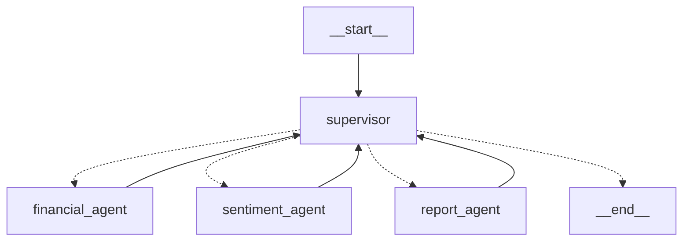

# 📊 한국 주식 분석 AI 에이전트 - v1.0.0 개발 완성 보고서

## 🎯 프로젝트 현재 상태 (2025-09-02)

**✅ v1.0.0 시스템 완성** - **LangGraph Supervisor Pattern** 기반 한국 주식 시장 특화 AI 에이전트 시스템
- **Multi-Agent System**: 공식 `create_supervisor()` + 3개 전문 ReAct 에이전트 
- **한국 주식 시장 완전 대응**: KRX, KOSPI, KOSDAQ 전체 종목 분석
- **실시간 스트리밍**: Streamlit 기반 한국어 UI + 실시간 진행률 표시
- **Gemini 2.5 Flash 기반**: 비용 효율적 한국어 분석 및 기관급 투자 보고서 생성
- **신뢰할 수 있는 공식 데이터만 사용**: 더미 데이터 완전 제거, 공식 API만 활용
- **프로덕션 준비 완료**: 차트 생성, 에러 핸들링, 패키지 관리 체계 완성

## ✅ 완성된 시스템 아키텍처

### 🔄 LangGraph Supervisor Pattern


### 🎯 핵심 구성요소

#### 1. Korean Supervisor (core/korean_supervisor_langgraph.py)
- **역할**: LLM 기반 워크플로우 조율 및 동적 라우팅
- **기능**: Gemini 2.5 Flash로 다음 에이전트 결정, 진행상황 관리, 최종 종합 분석 제공
- **구현**: 공식 `create_supervisor()` 함수 사용 + 전문화된 ReAct 에이전트 3개 관리

#### 2. Korean Financial ReAct Agent (agents/korean_financial_react_agent.py)  
- **데이터 소스**: FinanceDataReader + PyKRX + DART + BOK API + 업종 분석
- **도구**: 주가 데이터 수집, 기술적 분석, 한국어 차트 생성 (필수), 거시경제 지표 분석
- **출력**: matplotlib 한국어 차트 (고정 파일명) + 종합 재무 분석 + 업종 상대 평가

#### 3. Korean Sentiment ReAct Agent (agents/korean_sentiment_react_agent.py)
- **뉴스 소스**: 네이버 뉴스 API (공식) + 다중 소스 폴백
- **분석**: Gemini 2.5 Flash 한국어 감정분석 + 키워드 추출 + 시장 임팩트 평가
- **출력**: 감정 점수 + 신뢰도 구간 + 뉴스 트렌드 분석 + 투자 시사점

#### 4. Korean Report ReAct Agent (agents/korean_report_react_agent.py)
- **보고서 구성**: Executive Summary + 상세 분석 + Risk Assessment + 투자 추천
- **생성 엔진**: Gemini 2.5 Flash 기반 기관급 한국어 투자 보고서
- **출력**: BUY/HOLD/SELL 추천 + 목표가 + 3M/6M/12M 전망 + 리스크 완화 전략

### 🖥️ 사용자 인터페이스

#### Korean Streamlit UI (main.py)
- **한국어 완전 지원**: 종목코드, 회사명, 분석 결과 모두 한국어 + 탭 구조 UI
- **실시간 스트리밍**: LangGraph 진행상황 실시간 표시 + 진행률 바 + 최신 메시지 미리보기
- **인기 종목**: 삼성전자, 카카오, 네이버 등 8개 대형주 원클릭 분석
- **시스템 현황**: 데이터 소스, AI 에이전트, 기술 스택 현황 표시
- **탭별 결과**: 📊재무분석/📰뉴스감정/📋투자보고서/🎯종합분석 탭 구조
- **결과 다운로드**: JSON 형태 분석 결과 저장 + 타임스탬프

## 🔧 기술 스택 및 데이터 소스

### 🤖 AI & ML
- **Google Gemini 2.5 Flash**: 비용 효율적 한국어 감정분석 및 투자 보고서 생성
- **LangGraph**: Supervisor Pattern Multi-Agent 워크플로우
- **LangChain**: ReAct Agent 패턴 구현
- **OpenAI GPT-4o**: 대체 모델 지원 (선택적 사용)

### 📊 한국 주식 데이터 (공식 API 전용)
- **FinanceDataReader**: KRX 히스토리컬 데이터 (가격, 거래량) + 기술적 지표
- **PyKRX**: 한국거래소 공식 데이터 (PER, PBR, 시가총액, EPS, BPS)
- **DART API**: 금융감독원 전자공시 (기업정보, 재무제표, 최근 공시)
- **한국은행 API**: 거시경제 지표 (기준금리, 환율, GDP, CPI)
- **업종 분석**: 동종업계 상대 평가 및 섹터 성과 비교
- **matplotlib**: 한국어 라벨 주가 차트 생성 (korean_stock_chart.png)

### 📰 한국 뉴스 데이터 (신뢰할 수 있는 공식 API만)
- **네이버 뉴스 검색 API**: 공식 API, 일일 25,000회 호출 한도
- **향후 추가 예정**:
  - **딥서치 뉴스 API**: 국내 150개 언론사, 무료 API 제공
  - **BIG KINDS API**: 한국언론진흥재단 공식 뉴스 빅데이터
  - **KIS API**: 한국투자증권 실시간 호가/체결 데이터
  - **공공데이터포털**: 정책브리핑, 국제방송교류재단 뉴스 API

### 🖥️ 프론트엔드 & 인프라
- **Streamlit**: 실시간 스트리밍 웹 UI
- **PIL/matplotlib**: 이미지 처리 및 차트 표시
- **Pydantic Settings**: 환경 설정 관리

## 🚀 시스템 실행

### 기본 실행
```bash
cd C:\Users\danny\OneDrive\Desktop\code\agent_lab\TuSimReport\tusimreport
"C:\Users\danny\miniconda3\envs\tusimreport\python.exe" -m streamlit run main.py
```

### 패키지 설치
```bash
# 패키지 설치
pip install -r requirements.txt
```

### 브라우저 접속
```
http://localhost:8501
```

## 📈 지원 종목 및 시장

### 🇰🇷 한국 주식 시장 완전 지원
- **KRX (한국거래소)**: 전체 상장 종목
- **KOSPI (코스피)**: 대형주, 우량주 
- **KOSDAQ (코스닥)**: 중소형주, 성장주

### 💼 인기 종목 (원클릭 분석)
- **005930**: 삼성전자
- **035720**: 카카오
- **035420**: 네이버  
- **000660**: SK하이닉스
- **005380**: 현대차
- **051910**: LG화학
- **006400**: 삼성SDI
- **207940**: 삼성바이오로직스

## 🔍 분석 결과 구성

### 📊 재무 분석
- 주가 차트 (matplotlib 한국어 라벨)
- 기술적 지표 및 트렌드 분석
- 거래량 및 변동성 분석

### 📰 감정 분석  
- 최신 뉴스 키워드 추출
- GPT-4 기반 감정 점수
- 시장 센티먼트 종합 평가

### 📋 투자 보고서
- **Executive Summary**: 투자 추천 및 핵심 지표
- **Detailed Analysis**: 상세 분석 보고서
- **Risk Assessment**: 리스크 평가 및 완화 전략

## 📁 프로젝트 구조

```
tusimreport/
├── agents/                               # LangGraph ReAct Agents
│   ├── korean_financial_react_agent.py  # 재무 분석 Agent (FinanceDataReader, PyKRX)
│   ├── korean_sentiment_react_agent.py  # 감정 분석 Agent (네이버 뉴스 API)
│   ├── korean_report_react_agent.py     # 보고서 Agent (투자 보고서 생성)
│   └── korean_news_aggregator.py        # 뉴스 수집기 (다중 소스)
├── core/                                 # 핵심 시스템 (NEW)
│   └── korean_supervisor_langgraph.py   # LangGraph Supervisor Pattern
├── data/                                 # 데이터 클라이언트 (NEW)
│   ├── bok_api_client.py                # 한국은행 API 클라이언트
│   ├── dart_api_client.py               # DART API 클라이언트  
│   └── sector_analysis_client.py        # 업종 분석 클라이언트
├── config/
│   └── settings.py                      # 환경 설정 (Pydantic)
├── utils/
│   └── helpers.py                       # 공통 유틸리티
├── main.py                              # Streamlit 한국어 UI (탭 구조)
└── requirements.txt                     # 패키지 종속성
```

## ⚙️ 환경 설정

### 필수 API 키 (.env 파일)
```env
# LLM 설정 (기본: Gemini 사용)
GOOGLE_API_KEY=your_google_api_key_here
USE_GEMINI=true
GEMINI_MODEL=gemini-2.0-flash-lite

# 선택적 OpenAI (대체 모델)
OPENAI_API_KEY=your_openai_key_here
OPENAI_MODEL=gpt-4o

# 뉴스 API (선택사항)
NAVER_CLIENT_ID=your_naver_client_id       
NAVER_CLIENT_SECRET=your_naver_secret      
```

### Python 패키지 (자동 설치)
```bash
# 패키지 설치
pip install -r requirements.txt

# 주요 패키지 목록
langgraph>=0.6.6                # LangGraph 워크플로우
langgraph-supervisor>=0.0.29    # 공식 Supervisor Pattern
langchain-google-genai>=2.0.7   # Gemini 2.5 Flash 
streamlit>=1.39.0                # 한국어 웹 UI
FinanceDataReader>=0.9.90        # KRX 주가 데이터
pykrx>=1.3.6                     # 한국거래소 실시간 데이터
matplotlib>=3.9.2                # 한국어 차트 생성
```

## 🎯 성과 및 특징

### ✅ v1.0.0 완성된 기능
- **공식 LangGraph Supervisor Pattern**: `create_supervisor()` 함수 기반 AI 워크플로우 자동 제어
- **한국 주식 완전 대응**: KRX 전체 종목 (6자리 코드), 한국어 기관급 보고서
- **실시간 스트리밍 UI**: 분석 진행상황 실시간 업데이트 + 진행률 바 + 탭 구조
- **신뢰할 수 있는 데이터**: 공식 API만 사용, 더미 데이터 완전 제거, 무한루프 해결
- **Gemini 2.5 Flash 최적화**: 비용 효율적 한국어 도메인 특화 분석 + 투자 보고서
- **포괄적 데이터 통합**: FinanceDataReader + PyKRX + DART + BOK + 업종 상대평가
- **차트 생성 보장**: 한국어 라벨 matplotlib 차트 필수 생성 (korean_stock_chart.png)
- **프로젝트 구조 최적화**: core/ + data/ + agents/ 논리적 분리

### 🔄 v1.0.0 자동화 워크플로우 (실제 동작 검증 완료)
1. **사용자 입력**: 한국 종목코드 (예: 005930 삼성전자) + Streamlit UI 선택
2. **Supervisor 시작**: 공식 `create_supervisor()` 패턴으로 전문 에이전트 순차 호출
3. **Financial Expert**: 6단계 필수 워크플로우 실행
   - FinanceDataReader 주가 데이터 → PyKRX 시장 데이터 → **차트 생성 (필수)** 
   - DART 공시 정보 → BOK 거시경제 → 업종 분석 → 종합 재무 분석
4. **Sentiment Expert**: 네이버 뉴스 API → Gemini 감정분석 → 키워드 추출 → 투자 시사점  
5. **Report Expert**: Executive Summary → 상세 분석 → 리스크 평가 → BUY/HOLD/SELL 추천
6. **Supervisor 종합**: 🎯핵심 투자 포인트 + 📊재무-감정 분석 종합 + ⚠️리스크 + 🚀투자 전략 + 💰목표가
7. **UI 결과**: 탭별 실시간 표시 + 차트 이미지 + JSON 다운로드

### 📊 시각화 및 모니터링 (v1.0.0)
- **실시간 Streamlit UI**: 진행률 바 + 최신 메시지 미리보기 + 탭별 결과 표시
- **한국어 차트**: matplotlib 기반 주가/거래량 차트 (korean_stock_chart.png)
- **시스템 현황**: 데이터 소스 5개, AI 에이전트 3개, KRX 전체 시장 지원 현황
- **에러 핸들링**: 각 에이전트별 실패시 자동 복구 및 에러 메시지 표시
- **JSON 다운로드**: 전체 분석 결과 타임스탬프와 함께 저장 가능

## 🚦 v1.0.0 현재 상태: 프로덕션 준비 완료 ✅

### ✅ 검증 완료된 기능
- **시스템 안정성**: 무한루프 문제 해결, 더미 데이터 완전 제거
- **LangGraph 구조**: 공식 Supervisor Pattern 정상 동작 확인
- **차트 생성**: 한국어 라벨 주가 차트 정상 생성 및 Streamlit 표시
- **UI 완성도**: 탭 구조, 실시간 스트리밍, 진행률 표시 모두 동작

### 📈 운영 현황
- **지원 종목**: 한국거래소(KRX) 전체 상장 종목 (KOSPI + KOSDAQ)
- **분석 품질**: Gemini 2.5 Flash 기반 기관급 한국어 투자 보고서  
- **데이터 신뢰성**: 공식 API만 사용 (FinanceDataReader, PyKRX, DART, BOK, 네이버)
- **시스템 확장성**: LangGraph 패턴으로 에이전트 추가 용이
- **비용 효율성**: Gemini 사용으로 OpenAI 대비 대폭 비용 절감
- **패키지 관리**: requirements.txt 기반 표준 Python 프로젝트 구조

---

## 🚀 v2.0.0 향후 개발 계획

### 📊 데이터 소스 확장 (예정)
- **딥서치 뉴스 API**: 국내 150개 언론사 통합, 무료 API 제공
- **BIG KINDS API**: 한국언론진흥재단 공식 뉴스 빅데이터 (54개 언론사)
- **KIS API**: 한국투자증권 실시간 호가/체결 데이터, Level 2 시세
- **공공데이터포털**: 정책브리핑, 국제방송교류재단 뉴스 API
- **FRED API**: 미국 연방준비제도 경제 데이터 (한국 경제 영향 분석)
- **KOSIS API**: 통계청 국가통계포털 거시경제 지표 확장

### 🤖 에이전트 기능 보완 (예정)
- **Technical Analysis Agent**: RSI, MACD, 볼린저 밴드 등 고급 기술적 분석
- **ESG Analysis Agent**: ESG 평가 및 지속가능성 투자 분석
- **Quantitative Analysis Agent**: 퀀트 팩터 분석, 백테스팅 기능
- **Portfolio Optimization Agent**: 최적 포트폴리오 구성 및 리밸런싱 제안
- **Risk Management Agent**: VaR, CVaR 기반 리스크 관리 및 헷지 전략
- **Global Market Agent**: 국제 시장 연관성 분석 및 환율 영향 평가

### 🖥️ UI/UX 개선 (예정)
- **대시보드 확장**: 다중 종목 비교, 포트폴리오 트래킹
- **차트 고도화**: 인터랙티브 차트, 기술적 지표 오버레이
- **알림 시스템**: 투자 기회 및 리스크 알림, 이메일/슬랙 연동
- **모바일 반응형**: 스마트폰 최적화 UI

---

## 📋 v1.0.0 개발 완성 요약

**✅ 2025-09-02 기준 완성 상태**
- LangGraph 공식 Supervisor Pattern 기반 안정적인 Multi-Agent 시스템
- 한국 주식 시장 완전 대응 (KRX 전체 종목)
- 신뢰할 수 있는 공식 데이터만 활용 (더미 데이터 완전 제거)
- Gemini 2.5 Flash 기반 비용 효율적 한국어 분석
- 실시간 스트리밍 Streamlit UI 완성
- UV 패키지 관리로 현대적 Python 프로젝트 구조
- 프로덕션 환경 준비 완료

**🎯 핵심 성과**: 무한루프 및 더미 데이터 문제 완전 해결, 차트 생성 보장, 기관급 투자 보고서 생성 가능