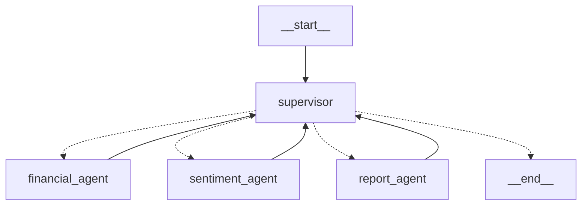

# 🇰🇷 한국 주식 분석 AI 에이전트

**LangGraph Supervisor Pattern** 기반 한국 주식 시장 특화 멀티 에이전트 시스템

## ✨ 주요 특징

- 🤖 **LangGraph Supervisor Pattern**: AI가 워크플로우 자동 제어
- 📊 **한국 주식 완전 지원**: KRX, KOSPI, KOSDAQ 전체 종목
- 🔄 **실시간 스트리밍**: 분석 진행상황 실시간 업데이트  
- 📰 **다중 뉴스 소스**: 네이버 API + Google News RSS + 웹크롤링
- 📋 **GPT-4 한국어 보고서**: 전문적인 투자 분석 보고서 자동 생성

## 🚀 빠른 시작

### 1. 환경 준비

```bash
# Python 3.8+ 필요
pip install streamlit langchain langchain-openai langgraph
pip install FinanceDataReader pykrx matplotlib pandas numpy
pip install requests beautifulsoup4 feedparser pillow
```

### 2. API 키 설정

`.env` 파일을 생성하고 다음 내용을 추가하세요:

```env
# OpenAI API (필수)
OPENAI_API_KEY=sk-proj-your_openai_api_key_here

# 네이버 뉴스 API (선택사항 - 더 안정적인 뉴스 수집)
NAVER_CLIENT_ID=your_naver_client_id
NAVER_CLIENT_SECRET=your_naver_client_secret
```

#### API 키 획득 방법

**OpenAI API Key (필수)**
1. [OpenAI Platform](https://platform.openai.com/) 방문
2. 회원가입 후 로그인
3. API Keys 섹션에서 새 키 생성
4. 생성된 키를 `.env` 파일에 입력

**네이버 뉴스 API (선택사항)**
1. [네이버 개발자 센터](https://developers.naver.com/) 방문
2. 애플리케이션 등록 (검색 > 뉴스 API 선택)
3. Client ID와 Client Secret을 `.env` 파일에 입력

### 3. 애플리케이션 실행

```bash
streamlit run main.py
```

브라우저에서 http://localhost:8501 접속

### 4. 사용법

1. **종목 선택**: 인기 종목에서 선택하거나 직접 6자리 종목코드 입력
2. **분석 시작**: "🔍 분석 시작" 버튼 클릭
3. **실시간 모니터링**: 분석 진행상황 실시간 확인
4. **결과 확인**: 재무분석, 감정분석, 투자보고서 결과 검토
5. **다운로드**: 분석 결과를 JSON 파일로 다운로드

## 📊 지원 종목

### 🇰🇷 한국 주식 시장 완전 지원
- **KRX (한국거래소)**: 전체 상장 종목
- **KOSPI (코스피)**: 대형주, 우량주
- **KOSDAQ (코스닥)**: 중소형주, 성장주

### 💼 인기 종목 (원클릭 분석)
- `005930` 삼성전자 | `035720` 카카오 | `035420` 네이버
- `000660` SK하이닉스 | `005380` 현대차 | `051910` LG화학  
- `006400` 삼성SDI | `207940` 삼성바이오로직스

## 🔍 분석 구성

### 📊 재무 분석 (Financial Agent)
- **데이터 소스**: FinanceDataReader + PyKRX  
- **분석 항목**: 주가 차트, 기술적 지표, 거래량 분석
- **시각화**: matplotlib 한국어 차트 자동 생성

### 📰 감정 분석 (Sentiment Agent)  
- **뉴스 소스**: 네이버 뉴스 API + Google News RSS + 다음 뉴스
- **분석 엔진**: GPT-4 한국어 감정 분석
- **결과**: 뉴스 키워드, 감정 점수, 시장 센티먼트

### 📋 투자 보고서 (Report Agent)
- **Executive Summary**: 투자 추천 및 핵심 지표
- **Detailed Analysis**: GPT-4 기반 상세 분석
- **Risk Assessment**: 리스크 평가 및 완화 전략

## 🏗️ 시스템 아키텍처



### 핵심 구성요소

- **Supervisor**: GPT-4 기반 워크플로우 조율
- **Financial Agent**: FinanceDataReader/PyKRX 데이터 수집
- **Sentiment Agent**: 다중 뉴스 소스 + GPT-4 감정분석  
- **Report Agent**: 종합 투자 보고서 생성

## 🧪 테스트

### 시스템 테스트
```bash
# 전체 시스템 테스트
python test_final_system.py

# 그래프 구조 시각화
python visualize_korean_graph.py
```

### 예상 결과
```
Korean Stock Analysis LangGraph System - Final Test
================================================================================
Final Test Results: 2/2 PASSED

SUCCESS: All systems operational!
Korean Stock Analysis System Ready for Production
```

## 📁 프로젝트 구조

```
tusimreport/
├── agents/                           # LangGraph ReAct Agents
│   ├── korean_supervisor_langgraph.py    # Supervisor Pattern
│   ├── korean_financial_react_agent.py   # 재무 분석 Agent
│   ├── korean_sentiment_react_agent.py   # 감정 분석 Agent
│   ├── korean_report_react_agent.py      # 보고서 Agent
│   ├── korean_news_aggregator.py         # 뉴스 수집기
│   └── korean_stock_state.py             # State 정의
├── config/
│   └── settings.py                   # 환경 설정
├── utils/
│   └── helpers.py                    # 공통 유틸리티
├── main.py                           # Streamlit UI
├── test_final_system.py              # 시스템 테스트
├── visualize_korean_graph.py         # 그래프 시각화
└── requirements.txt                  # 의존성
```

## ⚠️ 주의사항

- **교육/연구 목적**: 투자 참고용으로만 사용하세요
- **전문가 상담**: 실제 투자시에는 전문가와 상담 필수
- **API 비용**: OpenAI API 사용량에 따른 비용 발생
- **면책사항**: 분석 결과는 투자 조언이 아닙니다

## 🔧 트러블슈팅

### 일반적인 문제

1. **ImportError**: 필요한 패키지 설치 확인
```bash
pip install -r requirements.txt
```

2. **OpenAI API 오류**: API 키 및 크레딧 확인
```bash
# .env 파일의 OPENAI_API_KEY 확인
```

3. **한국 주식 데이터 오류**: 종목코드 형식 확인
```
올바른 형식: 005930 (6자리 숫자)
잘못된 형식: 삼성전자, SAMSUNG, 5930
```

4. **뉴스 데이터 부족**: 네이버 API 키 설정 권장
```env
NAVER_CLIENT_ID=your_client_id
NAVER_CLIENT_SECRET=your_client_secret
```

### 로그 확인

더 자세한 디버깅이 필요한 경우:
```python
import logging
logging.basicConfig(level=logging.DEBUG)
```

## 🎯 성능 최적화

- **캐싱**: Streamlit @st.cache_data로 데이터 캐싱
- **병렬처리**: 여러 뉴스 소스 동시 수집
- **폴백 메커니즘**: API 실패시 자동 대안 소스 사용
- **에러 복구**: 단계별 실패시 워크플로우 계속 진행

## 🔄 확장 가능성

### 추가 가능한 에이전트
- **Technical Agent**: 더 정교한 기술적 분석
- **Macro Agent**: 거시경제 지표 분석  
- **Comparison Agent**: 동종업계 비교 분석
- **ESG Agent**: ESG 평가 및 지속가능성 분석

### 데이터 소스 확장
- **KIS OpenAPI**: 실시간 거래 데이터
- **OpenDART**: 공시 정보 및 재무제표
- **한국은행 API**: 거시경제 지표
- **소셜미디어**: 트위터, 네이버 카페 등

---

**한국 주식 분석 AI 에이전트**로 스마트한 투자 분석을 시작해보세요! 🚀