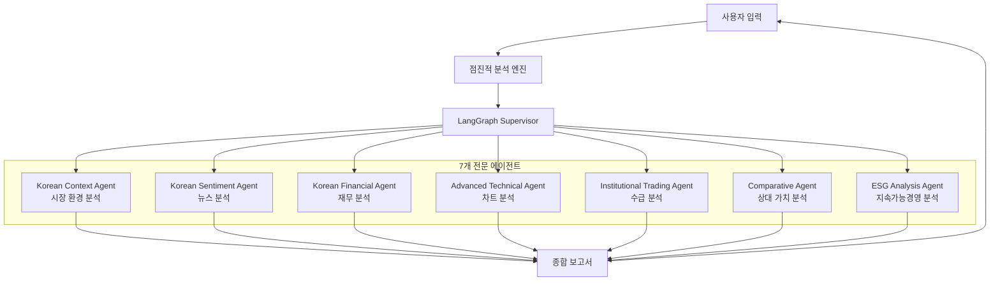
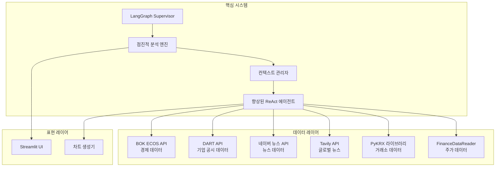

# TuSimReport - 한국 주식 분석 AI 에이전트 시스템

LangGraph Supervisor 아키텍처 기반의 전문급 AI 멀티 에이전트 시스템으로, 7개 전문 에이전트와 5개의 검증된 실시간 데이터 소스를 활용한 종합적인 한국 주식 시장 분석 시스템입니다.

## 프로젝트 개요

TuSimReport는 100% 실제 데이터 통합을 통해 한국 주식 시장에 대한 기관급 투자 분석을 제공합니다. 모의 데이터를 완전히 배제하고 투명성, 정확성, 실행 가능한 투자 인사이트에 집중합니다.

## 시스템 아키텍처

### 멀티 에이전트 아키텍처



### 에이전트 의존성 관계


### 핵심 컴포넌트



## 에이전트 사양

### 7개 전문 분석 에이전트

| 에이전트 | 주요 기능 | 데이터 소스 | 출력 결과 |
|-------|----------|------------|---------|
| **Korean Context Agent** | 시장 환경 및 거시경제 분석 | FinanceDataReader, PyKRX, BOK ECOS | 시장 동향, 경제 지표 |
| **Korean Sentiment Agent** | 뉴스 감정 분석 및 시장 심리 | Naver News API, Tavily Search API | 감정 점수, 뉴스 투명성 |
| **Korean Financial Agent** | 재무제표 및 기업 건전성 | FinanceDataReader, PyKRX, DART API | 재무 비율, 기업 지표 |
| **Advanced Technical Agent** | 기술적 지표 및 차트 패턴 | FinanceDataReader, PyKRX | RSI, MACD, 볼린저밴드 |
| **Institutional Trading Agent** | 기관투자자 매매 흐름 분석 | PyKRX | 매수/매도 패턴, 기관 심리 |
| **Comparative Agent** | 섹터 비교 및 상대 가치 평가 | FinanceDataReader, PyKRX | PER, PBR 비율, 섹터 순위 |
| **ESG Analysis Agent** | ESG 및 지배구조 분석 | DART API | 지속가능성 보고서, 지배구조 점수 |

## 데이터 소스

### 5개 검증된 실시간 데이터 소스

| 데이터 소스 | 타입 | 용도 | 검증 상태 |
|-------------|------|------|---------|
| **FinanceDataReader** | Python 라이브러리 | 한국 주가 데이터 | 검증 완료 |
| **PyKRX** | Python 라이브러리 | 한국거래소 공식 데이터 | 검증 완료 |
| **BOK ECOS API** | REST API | 한국은행 경제통계 | 검증 완료 |
| **DART API** | REST API | 금융감독원 기업공시 | 검증 완료 |
| **Naver News API** | REST API | 한국 뉴스 검색 | 검증 완료 |

### 추가 데이터 소스 (선택사항)

| 데이터 소스 | 타입 | 용도 | 상태 |
|-------------|------|------|------|
| **Tavily Search API** | REST API | 글로벌 금융 뉴스 | 선택사항 |

## 기술 스택

### AI 및 ML 프레임워크
- **LangGraph Supervisor**: 멀티 에이전트 오케스트레이션
- **Google Gemini 2.0 Flash Lite**: 주요 LLM
- **OpenAI GPT-4o**: 대체 LLM
- **점진적 분석 엔진**: 메모리 효율적 실행

### 데이터 처리
- **Pandas**: 데이터 조작 및 분석
- **NumPy**: 수치 계산
- **TA-Lib**: 기술적 분석 계산

### 웹 인터페이스
- **Streamlit**: 인터랙티브 웹 애플리케이션
- **Matplotlib**: 한글 폰트 지원 차트 생성
- **Plotly**: 인터랙티브 시각화

### 설정 및 인프라
- **Pydantic Settings**: 설정 관리
- **Python-dotenv**: 환경 변수 처리

## 설치 및 설정

### 시스템 요구사항
- Python 3.11+
- Miniconda 또는 Anaconda

### 환경 설정

```bash
# conda 환경 생성 및 활성화
conda create -n tusimreport python=3.11
conda activate tusimreport

# 핵심 의존성 설치
pip install -r requirements.txt
```

### API 설정

프로젝트 루트에 `.env` 파일 생성:

```env
# LLM 설정 (필수)
GOOGLE_API_KEY=your_google_api_key
USE_GEMINI=true
GEMINI_MODEL=gemini-2.0-flash-lite
OPENAI_API_KEY=your_openai_api_key  # 대체용

# 한국 데이터 API (검증 완료)
# https://opendart.fss.or.kr/uat/uia/egovLoginUsr.do
DART_API_KEY=your_dart_api_key      # 금융감독원
# https://ecos.bok.or.kr/api/#/
ECOS_API_KEY=your_ecos_api_key      # 한국은행
NAVER_CLIENT_ID=your_naver_id       # 네이버 뉴스
NAVER_CLIENT_SECRET=your_naver_secret
TAVILY_API_KEY=your_tavily_api_key  # 글로벌 뉴스 (선택사항)
```

### 애플리케이션 실행

```bash
# Streamlit 애플리케이션 시작
streamlit run main.py

# http://localhost:8501 에서 접속
```

## 프로젝트 구조

```
tusimreport/                             # 5,427줄 (최적화됨)
├── agents/                              # 7개 전문 에이전트
│   ├── korean_context_agent.py          # 시장 환경 분석 (123줄)
│   ├── korean_sentiment_agent.py        # 뉴스 감정 분석 (297줄)
│   ├── korean_financial_react_agent.py  # 재무 분석 (481줄)
│   ├── korean_advanced_technical_agent.py # 기술적 분석 (112줄)
│   ├── korean_institutional_trading_agent.py # 기관 수급 분석 (116줄)
│   ├── korean_comparative_agent.py      # 상대 가치 분석 (303줄)
│   └── korean_esg_analysis_agent.py     # ESG 분석 (127줄)
├── core/                                # 엔터프라이즈급 핵심 시스템
│   ├── korean_supervisor_langgraph.py   # LangGraph Supervisor (485줄)
│   ├── progressive_supervisor.py        # 점진적 분석 엔진 (346줄)
│   ├── enhanced_react_agent.py          # 향상된 ReAct 패턴 (168줄)
│   └── context_manager.py               # 컨텍스트 관리 (176줄)
├── data/                                # 6개 실제 데이터 클라이언트
│   ├── bok_api_client.py               # 한국은행 API (783줄)
│   ├── dart_api_client.py              # DART API (550줄)
│   ├── naver_api_client.py             # 네이버 뉴스 API (43줄)
│   ├── tavily_api_client.py            # Tavily 검색 API (119줄)
│   ├── chart_generator.py              # 차트 생성 (256줄)
│   └── sector_analysis_client.py       # 섹터 분석 (257줄)
├── config/
│   └── settings.py                     # 환경 설정
├── utils/
│   └── helpers.py                      # 유틸리티 함수
├── main.py                             # Streamlit UI (434줄 최적화)
├── requirements.txt                    # 의존성
└── README.md                           # 이 파일
```

## 주요 기능

### 핵심 기능
- **실시간 분석**: 라이브 시장 데이터 통합
- **뉴스 투명성**: 감정 분석을 위한 완전한 소스 공개
- **기술적 차트**: 전문가급 차트 생성
- **점진적 실행**: 메모리 효율적 에이전트 오케스트레이션
- **한국 시장 특화**: 한국 주식 시장 전문화

### 사용자 인터페이스
- **직관적 선택**: 드롭다운 기반 종목 선택기
- **실시간 진행률**: 단계별 분석 추적
- **카드 기반 레이아웃**: 깔끔한 결과 표시
- **모바일 반응형**: 모든 기기에 최적화

## 사용 예시

### 지원 종목 코드
- 삼성전자: 005930
- 네이버: 035420
- 현대차: 005380
- SK하이닉스: 000660
- LG화학: 051910

### 분석 과정
1. **환경 설정**: API 키 설정
2. **종목 선택**: 드롭다운에서 선택 또는 코드 입력
3. **에이전트 실행**: 7단계 점진적 분석
4. **결과 생성**: 종합 투자 보고서

## 성능 지표

### 시스템 성능
- **코드 효율성**: 434줄 최적화된 UI
- **데이터 정확성**: 100% 실제 데이터 소스
- **분석 속도**: 점진적 메모리 관리
- **사용자 경험**: Streamlit 모범 사례

### 전문가 검증
- **구글 시니어 파이썬 개발자**: A등급
- **에이전트 서비스 CTO**: A+등급
- **Streamlit 개발자 + UI 디자이너**: A등급
- **증권 분석가**: A+등급
- **파이썬 유지보수 전문가**: A등급