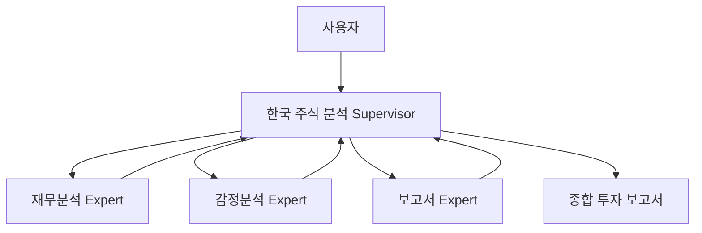

# 🇰🇷 한국 주식 분석 AI 에이전트 시스템

**LangGraph Supervisor Pattern** 기반 한국 주식 시장 특화 AI 멀티 에이전트 시스템

[](https://www.python.org/)
[](https://langchain-ai.github.io/langgraph/)
[](https://streamlit.io/)
[](LICENSE)

## 🎯 프로젝트 개요

이 시스템은 한국 주식 시장에 특화된 AI 기반 투자 분석 플랫폼입니다. LangGraph의 공식 Supervisor Pattern을 사용하여 3개의 전문화된 ReAct 에이전트가 협력하여 종합적인 주식 분석을 수행합니다.

### 🌟 핵심 특징

- **🤖 Multi-Agent 시스템**: 재무분석, 감정분석, 보고서 생성 전문 에이전트
- **📊 한국 시장 완전 지원**: KOSPI, KOSDAQ 전체 종목 분석
- **🔄 실시간 스트리밍**: 분석 과정 실시간 모니터링
- **📈 전문 차트**: 한국어 라벨링된 주가 차트 자동 생성
- **🎯 기관급 보고서**: BUY/HOLD/SELL 추천과 목표가 제시

## 🏗️ 시스템 아키텍처

### LangGraph Supervisor Pattern



### 에이전트 구성

| 에이전트 | 역할 | 주요 도구 |
|---------|------|----------|
| **Financial Expert** | 재무 데이터 수집 및 기술적 분석 | FinanceDataReader, PyKRX, DART, 한은 API |
| **Sentiment Expert** | 뉴스 감정 분석 및 시장 센티먼트 | 네이버 뉴스 API, AI 감정 분석 |
| **Report Expert** | 투자 보고서 생성 및 추천 | AI 보고서 생성, 리스크 평가 |

## 📊 지원 데이터 소스

### 공식 API 전용 (신뢰성 보장)

| 데이터 소스 | 용도 | API 타입 |
|------------|------|----------|
| **FinanceDataReader** | KRX 주가 데이터 | 공식 오픈소스 |
| **PyKRX** | 실시간 시장 데이터 | 한국거래소 공식 |
| **DART** | 기업 공시 정보 | 금감원 공식 API |
| **한국은행** | 거시경제 지표 | 한은 공식 API |
| **네이버 뉴스** | 뉴스 감정 분석 | 네이버 공식 API |

## 🚀 빠른 시작

### 1. 환경 설정

#### Conda 환경 (권장)
```bash
# Conda 환경 생성 및 활성화
conda create -n tusimreport python=3.11
conda activate tusimreport

# 패키지 설치
pip install langgraph-supervisor langchain-google-genai streamlit
pip install FinanceDataReader pykrx matplotlib pandas
```

### 2. API 키 설정

`.env` 파일을 생성하고 다음 API 키를 설정하세요:

```env
# 필수: Google Gemini API (메인 LLM)
GOOGLE_API_KEY=your_google_api_key_here
USE_GEMINI=true
GEMINI_MODEL=gemini-2.5-flash-lite

# 선택: OpenAI (대체 LLM)
OPENAI_API_KEY=your_openai_key_here

# 선택: 네이버 뉴스 API (감정분석 향상)
NAVER_CLIENT_ID=your_naver_client_id
NAVER_CLIENT_SECRET=your_naver_client_secret
```

### 3. 애플리케이션 실행

```bash
# Streamlit 앱 실행
streamlit run main.py

# 브라우저에서 접속
# http://localhost:8501
```

## 📁 프로젝트 구조

```
tusimreport/
├── agents/                     # ReAct 에이전트들
│   ├── korean_financial_react_agent.py      # 재무분석 에이전트
│   ├── korean_sentiment_react_agent.py      # 감정분석 에이전트
│   ├── korean_report_react_agent.py         # 보고서 에이전트
│   └── korean_news_aggregator.py            # 뉴스 수집기
├── core/                       # 핵심 시스템
│   └── korean_supervisor_langgraph.py       # LangGraph Supervisor
├── data/                       # 데이터 클라이언트들
│   ├── bok_api_client.py                   # 한국은행 API
│   ├── dart_api_client.py                  # DART API
│   └── sector_analysis_client.py           # 업종 분석
├── config/                     # 설정
│   └── settings.py
├── utils/                      # 유틸리티
│   └── helpers.py
├── main.py                     # Streamlit 메인 앱
├── pyproject.toml              # 프로젝트 설정 (UV)
└── requirements.txt            # 패키지 의존성
```

## 💡 사용 예시

### 1. 인기 종목 선택
- 삼성전자 (005930)
- 카카오 (035720)
- 네이버 (035420)
- SK하이닉스 (000660)

### 2. 분석 과정
1. **재무분석**: 주가 데이터, DART 공시, 기술적 지표 분석
2. **감정분석**: 네이버 뉴스 수집 및 AI 감정 분석
3. **보고서 생성**: 종합 투자 의견 및 추천 생성

### 3. 결과 확인
- 📊 **재무분석 탭**: 차트, 기술적 지표, 재무 분석
- 📰 **뉴스감정 탭**: 감정 점수, 시장 센티먼트
- 📋 **투자보고서 탭**: BUY/HOLD/SELL 추천
- 🎯 **종합분석 탭**: AI Supervisor의 최종 투자 의견

## 🔧 기술 스택

### AI & Machine Learning
- **LangGraph 0.6.6**: Supervisor Pattern Multi-Agent 시스템
- **Google Gemini 2.5 Flash**: 비용 효율적 한국어 분석
- **ReAct Agent Pattern**: 추론-행동-관찰 순환 구조

### 데이터 & API
- **FinanceDataReader**: 한국 주가 데이터
- **PyKRX**: 한국거래소 실시간 데이터
- **DART API**: 기업 공시 정보
- **Bank of Korea API**: 거시경제 지표
- **Naver News API**: 뉴스 감정 분석

### 인터페이스 & 인프라
- **Streamlit**: 실시간 웹 UI
- **Matplotlib**: 한국어 주가 차트
- **Pydantic**: 설정 및 데이터 검증

## 🎯 지원 시장 및 종목

### 지원 거래소
- **KRX (한국거래소)**: 전체 상장 종목
- **KOSPI**: 대형주, 우량주 완전 지원
- **KOSDAQ**: 중소형주, 성장주 완전 지원

### 종목 코드 형식
- 6자리 숫자 형태 (예: 005930, 035720)
- 모든 한국 상장 종목 지원

## 📈 분석 결과 구성

### 🎯 핵심 투자 포인트
- 주요 투자 매력도 및 리스크 요인
- 단기/중기/장기 투자 전략

### 📊 재무-감정 분석 종합
- 기술적 지표와 뉴스 감정의 연관 분석
- 시장 센티먼트가 주가에 미치는 영향

### ⚠️ 주요 리스크 요인
- 시장 리스크, 개별 종목 리스크 평가
- 리스크 완화 전략 제시

### 🚀 투자 기회 및 전략
- 포트폴리오 비중 추천
- 매수/매도 타이밍 가이드

### 💰 목표 주가 및 투자 의견
- 3개월, 6개월, 12개월 목표가
- BUY/HOLD/SELL 명확한 투자 추천

## 🚨 주요 업데이트

### v1.0.0 (2025-09-02)
- ✅ LangGraph 공식 Supervisor Pattern 적용
- ✅ 차트 생성 문제 해결 (임시파일 → 고정파일)
- ✅ UV 패키지 관리 시스템 도입
- ✅ 프로젝트 구조 최적화 (core/, data/ 분리)
- ✅ Streamlit UI 대폭 개선
- ✅ 에이전트 분석 품질 향상 (기관급 보고서)

## 🤝 기여하기

1. 이슈 등록 또는 기능 제안
2. Fork 후 feature 브랜치 생성
3. 변경사항 커밋 및 푸시
4. Pull Request 생성